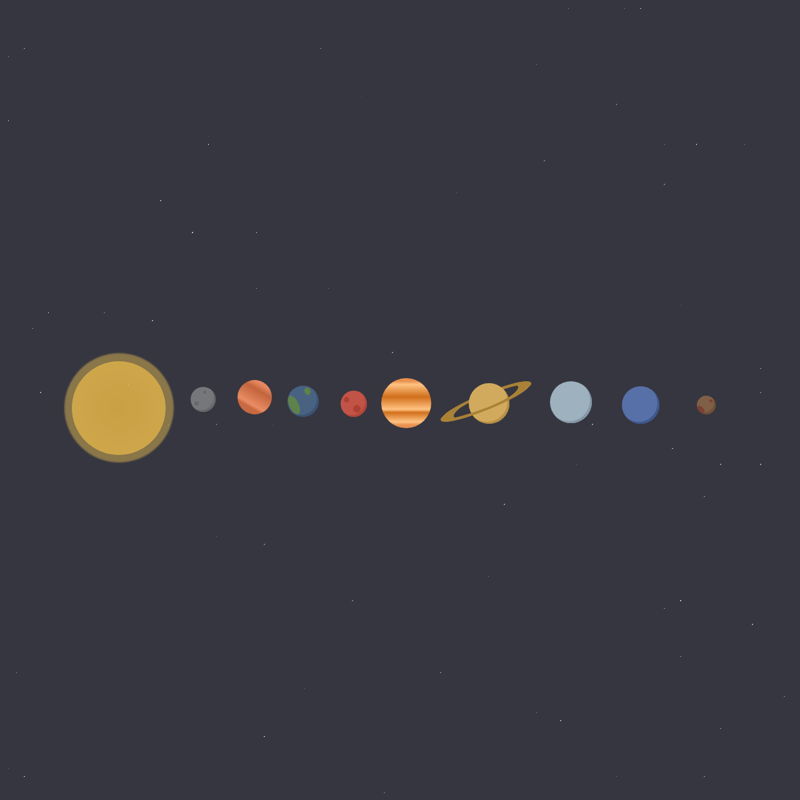

# Solar System Visualization

This project is a CSS-based visualization of the Solar System, featuring the sun and the planets. It provides an artistic representation using purely HTML, CSS, and JavaScript (with jQuery) for creating animations and interactive visuals.

## Features
- **CSS-Based Solar System**: A visual representation of the sun and planets, designed using CSS shapes and animations.
- **Dynamic Star Background**: A starry background that gives the impression of a universe, with randomly positioned stars that twinkle.
- **Pure CSS Animations**: Animations used for planet rotation and sun effects to create an engaging visualization without relying on external libraries beyond jQuery.

## Files
- **index.html**: Contains the structure for the Solar System visualization, including elements representing planets, stars, and the sun.
- **style.css**: Handles the styling of the sun, planets, and starry universe, with specific CSS for each planetary element and animations to make the scene visually dynamic.
- **index.js**: Contains the JavaScript code responsible for creating stars dynamically and handling additional interactive behaviors.

## Technologies Used
- **HTML5**: Provides the markup for the Solar System, including divs for each celestial object.
- **CSS3**: Responsible for styling the planets, stars, and other visual elements, as well as creating animations that mimic planetary movements.
- **JavaScript (with jQuery)**: Used for generating stars dynamically to populate the background.

## Screenshot

## License
This project is open-source and available under the MIT License.

